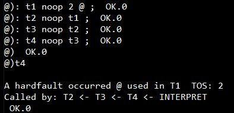

## Hard fault handler

- [****hard-fault.f****](hard-fault.f) ; Patch the hard fault handler. This provides detailed information about the location, and code path to a hard fault error.

***

<h3>Hard fault example</h3>

