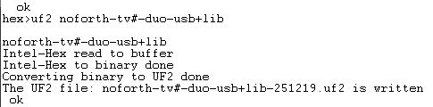

## Generating turnkey images

An UF2 image generator will be added as an extra tool for noForth t. This tool runs on win32Forth and uses an Intel-Hex image generator from the [this file](../Tools/image.f) or from the library ( Type: NEED IMAGE ) of noForth t.
This allows you to build your own self-starting noForth apps.

The [win32Forth](https://sourceforge.net/projects/win32forth/files/) program is called: Build-UF2-v3.f
And this is how you use it: 

> HEX>UF2 “filename”

A file named “filename.hex” is read. This is converted in three steps to a UF2 file named “filename-current-date.uf2”.

- [****Build-UF2-v3.f****](Build-UF2-v3.f) ; Convert an Intel-Hex file to a working UF2-file

***

<h3>Usage example</h3>

The image used is the last frozen image!

1. Load the image generator: NEED IMAGE
 Or using the file: [image.f](../Tools/image.f)
2. Open the log function of your terminal emulator
3. Type: CORE IMAGE
4. An Intel-Hex is generated
5. Copy the logged Intel-Hex to an text editor
6. Clean the text file of non Intel-Hex text
7. Start win32Forth
8. Load the file: Build-UF2-v3.f
9. Type: HEX>UF2 “filename”
10. The resulting UF2 is saved e.g. "filename-251010.uf2"
11. Now your personal UF2 is ready

---

<H4>A logged win32Forth UF2 session</h4>

