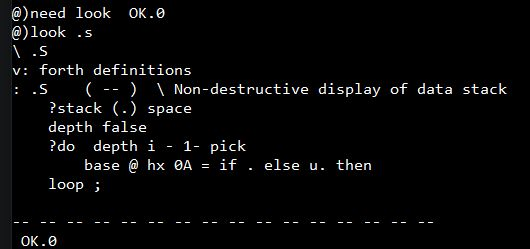

## A library in Flash

- [****library V2a a short overview.pdf****](library%20V2a%20a%20short%20overview.pdf) ; Contains a short overview of all library chapters
- [****need-052a.f****](need-052.f) ; Contains the basic routines for using the library
- [****write-lib-03c.f****](write-lib-03c.f) ; Read write and erase routines for the library
- [****Lib-source-50.f****](Lib-source-50.f) ; The complete library in source form
- [****adjust0.f****](adjust0.f) ; Restore the main library pointer
- [****finish.f****](finish.f) ; Cut of library tools, restore all pointers and add the noForth tools chapter
- [****print-stack.f****](print-stack.f) ; Show stack comment of the requested library chapter

***

<h3>Loading and using LOOK</h3>

