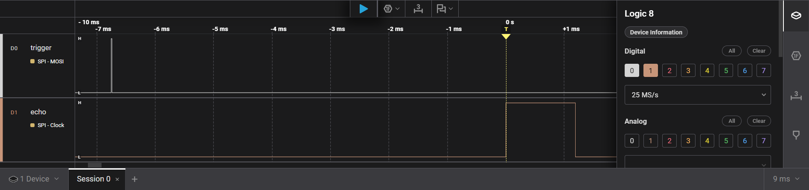

## PIO files generated with the EXPORT function ##

These files need only the file [****piobase.f****](../piobase.f) to execute.

- [****Flasher-1****](Flash-1.f) ; Simple LED flasher
- [****Flasher-2****](Flash-2.f) ; Controlable LED flasher
- [****Flasher-3****](Multiflash.f) ; Controlable LED flasher & basic WS2812B smart LED driver
- [****Flasher-4****](WS2812B-Pico.f) ; Basic WS2812B smart LED driver on GPIO23
- [****Flasher-5****](WS2812B-multi-color-driver.f) ; Multi color WS2812B smart LED driver on GPIO28 (max. 730 leds)
- [****Drive way simulation****](Car-04.f) ; Single drive way simuation using a string of WS2812B leds
- [****Bluetooth UART****](uart-5,-(GPIO8&9)-bluetooth-KEY-&-EMIT.f) ; 9600 baud Bluetooth KEY & EMIT for noForth
- [****Ultrasonic-sensor****](Ultrasonic-sensor-pio-ready-1.f) ; HC-SR04, etc. universal ultrasonic sensor driver with result in cm
- [****Ultrasonic-sensor****](Ultrasonic-sensor-pio-ready-2.F) ; HC-SR04, etc. shorter universal ultrasonic sensor driver with result in mm
- [****Drive ten RC-servos****](10-servo-control-using-exec-(GPIO4to13)-pio-ready.f) ; PIO driver for 10 RC-servos, pulsewidth from about .5ms to 2.5ms. Uses state machine 0 & 1 of PIO0 and the EXEC function on the OUT opcode

***

	**Ultrasonic sensor in action**

***
***

    **PIO servo controller 8 of ten outputs visible**

***

   **PIO servo controller code, at work and scope view**
   
https://github.com/user-attachments/assets/720e595c-765a-454e-b25d-56456eda4e10

***
