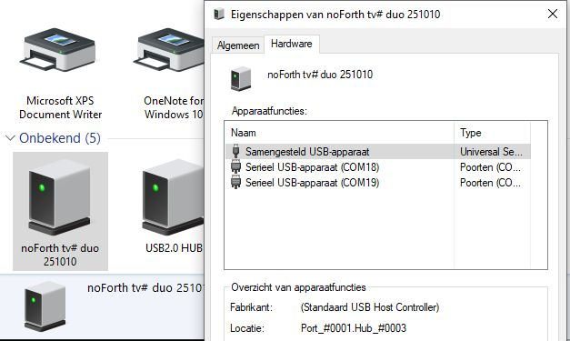
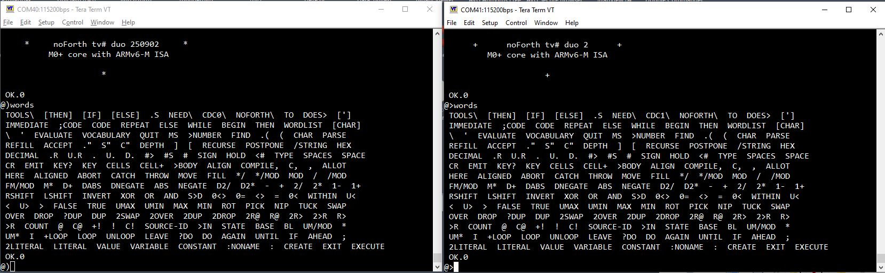

<h1 align="center"> dual USB CDC driver </h1>

A compact in low level implemented dual port CDC driver.
It is implemented in three tasks of our cooperative multitasker.
The whole driver only needs about 4400 bytes.

    1) Task-1 for the setup stage and input of data
    2) Task-2 does output CDC0 data but only when a connection is live.
    3) Task-3 does output CDC1 data but only when a connection is live.

The word USB-ON activates this CDC driver.

***

Connect a USB to serial cable to GPIO0 & GPIO1, reset noForth.
After noForth t is booted, take the following actions.

**Add the dual CDC driver:**

    1) Load the file: tasker.f
    2) Load the file: USB-XS-008a.f
    3) Type: SWITCH <enter> <enter>
    4) Load the file: USB-XS-008b.f
    5) Type: SWITCH <enter> <enter>
    6) Type: FREEZE <enter>
    7) Type: COLD or press reset and ready
       noForth will boot with a dual CDC driver

***

**Dual CDC driver in detail**

***

***

**noForth t duo booted and using dual CDC**

***